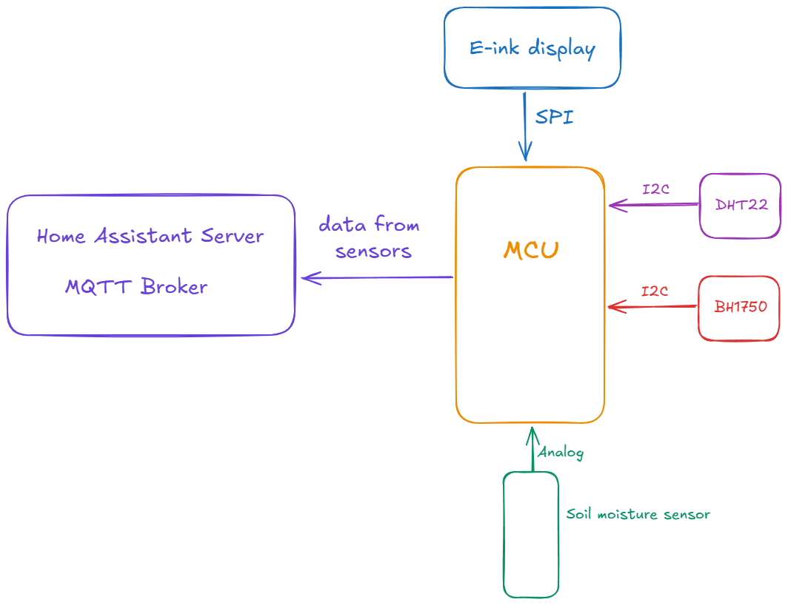
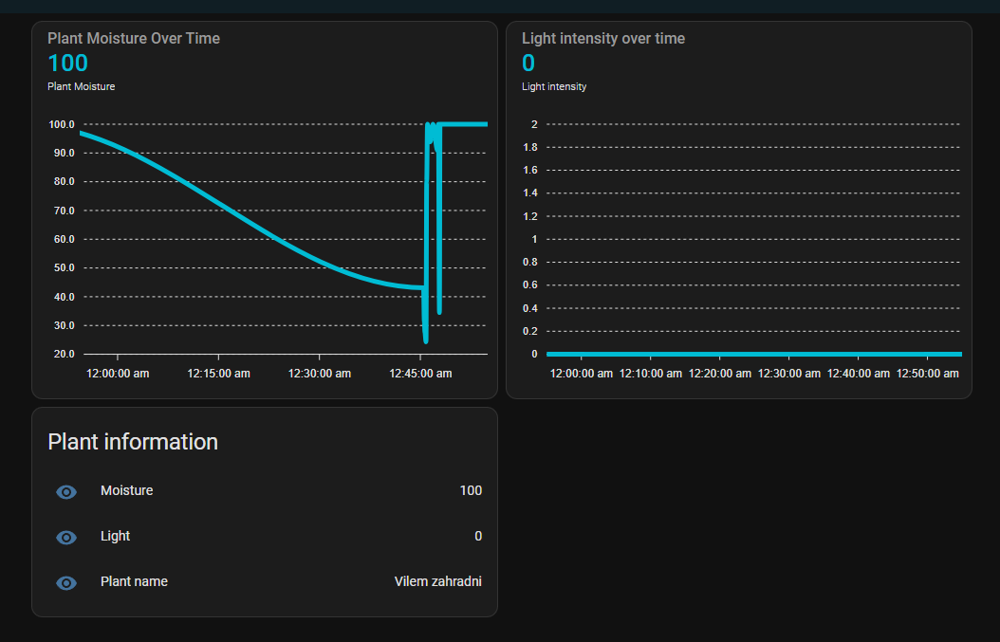
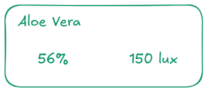
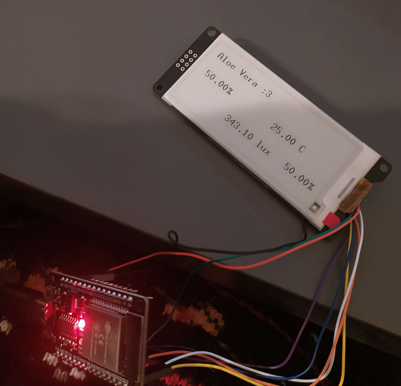

# IMP Projekt

## Systém na monitorování pokojové rostliny

### Autor: Dominik Huml (xhumld00@vutbr.cz)

### Úvod

Cílem tohoto projektu bylo vytvořit jednoduchý systém pro monitorování mých pokojových rostlin. Jelikož mám různé druhy rostlin,které mají různé požadavky na prostředí, tak pamatovat si kdy mám jaké zalít je náročné. Proto jsem vytvořil tento projekt. Projekt se skládá z mikrokontroleru ESP32, a obsahuje různé senzory pro monitorování stavů rostliny. Dále má také E-ink display pro zobrazení stavu přímo u květináče. Pro podrobnější informace má projekt integraci s Home Assistanem.

### Návrh

### Realizace

Projekt jsem realizoval v jazyce Rust pomocí frameworku ESP-IDF.

#### Periferie

-   **BH1750**: Senzor pro měření intenzity světla, komunikace probíhá pomocí I2C.
-   **DHT22**: Senzor pro měření vlhkosti a teploty vzduchu, komunikace probíhá pomocí I2C. V projektu momentálně není použitý, jelikož jsem z něj dostával nevalidní hodnoty. Pravděpodobně je vadný, protože byl zakoupen za pár korun z asijských stránek.
-   **Capacitive Soil Moisture Sensor V2.0**: Senzor pro měření vlkosti půdy, čtení probíhá analogově.
-   **Waveshare 2.91inch E-ink**: Displej pro zobrazení stavu přímo v květináči. Komunikace probíhá přes SPI.

#### Home Assistant

Pro tento projekt jsem si spustil vlastní Home Assistant server a k němu MQTT brokera (konkrétně Mosquitto) pomocí docker kontejneru. Mikrokontroler periodicky čte hodnoty ze sensoru, a poté je pošle přes MQTT. Moměntálně využívám tyto "topicy":

-   `sensor/soil_moisture` - vlhkost půdy v procentech
-   `sensor/light_intensity` - intenzita světla v luxech
-   `config/plant_name` - jméno rostliny

#### Kalibrace senzoru

Senzor pro měření vlhkosti půdy byl potreba kalibrovat. Pro kalibraci jsem zvolil metodu lineární predikce, kdy jsem si změřil hodnotu naprosto suché půdy, poté hodnotu totálně vodou saturované půdy, a pak vytvořil lineární funkci. Není to optimální metoda, jelikož měřené hodnoty nejsou lineárně úměrné procentuům, ale je to dostatečně dobrý odhad.

#### Displej

Na displeji se zobrazují informace o stavu rostliny. Je zde jméno rostliny, aktuální vlhkost a aktuální intenzita osvětlení.

### Spuštění projektu

Je potřeba mít vývojové prostředí pro Rust a ESP-IDF, lze následovat tento [návod](https://docs.esp-rs.org/book/installation/index.html). Dále je pak potřeba Home Assistant server a MQTT broker. Oba dva jsem nakonfiguroval v `docker-compose.yaml` souboru. Ukázková konfigurace pro HA je v souboru `configuration.yaml`. Projekt pak lze spustit přes `cargo run --release`.

### Stav projektu

Projekt zvládá měřit intenzitu světla a vlhkost půdy, zvládá tyto informace zobrazovat na displeji, a posílat je na HA server.

### Plány do budocnosti

Pro projekt bych chtěl vytvořit krabičku na 3D tiskárně, aby byl více kompaktní a mohl být integrován do květináče. Momentálně jde spíše o prototyp. Dále bych chtěl přidat vetší integraci s Home Assistantem, jak už konfiguraci přímo z webu, tak třeba notifikace o stavu rostliny.
